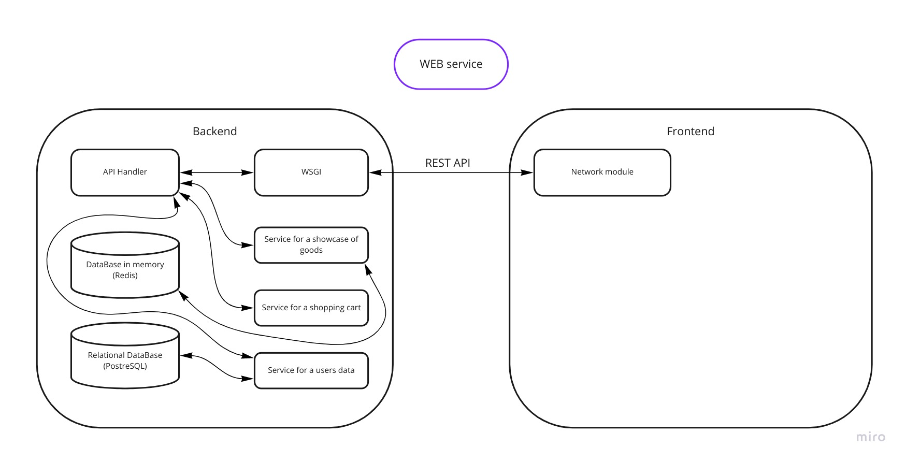

# Web service for honey shop

Technologies:
- FastAPI
- PyTest

### Project architecture

### Tests

run `python -m pytest` in the root of project

### Databases

1. Redis
2. SQLite
3. PostreSQL

Let`s compare these variants. Here what I find on the websites:

1. #### Pros of Redis:
- It’s super fast. Faster than any other cashing out there.
- Due to easy setup, Redis is Simple and easy to use.
- Redis has flexible data structures, it supports almost all data structures.
- Redis allows storing key and value pairs as large as 512 MB.
- Redis uses its own hashing mechanism called Redis Hashing.
- Zero downtime or performance impact while scaling up or down.
- Last and probably the very obvious point, it is open source and stable

####    Cons Of Redis:
- Since Data is sharded based on the hash-slots assigned to each Master. If Master holding some slots is down, data to be written to that slot will be lost.
- Clients connecting to the Redis cluster should be aware of the cluster topology, causing overhead configuration on Clients.
- Failover does not happen unless the master has at least one slave.
- It requires a huge ram because it is in-memory so are not supposed to use it on ram servers.

#### Summary: Redis is easy to use, fast and have all needed data structures but can skip some messages and require huge RAM memory on a servers.

2. #### Pros of SQLite
- SQLite doesn’t require a server to run.
- SQLite is a lightweight, simple option. It doesn’t require a lot of database admin, and it’s also light on required resources.
- SQLite is (usually) faster than a server-based counterpart or a file-based system. This is because it only loads needed data, rather than entire files.

#### Cons of SQLite
- No network access. It doesn’t allow for remote work on another PC, for instance.
- It’s not suitable for large scale apps
- It has a limited database size

#### Summary: SQLite easy to use and setting but it has no network access and have a limited size which bring us to replace this database to another later.

3. #### Pros of PostgreSQL
- Can run dynamic websites and web apps as a LAMP stack option.
- PostgreSQL’s write-ahead logging makes it a highly fault-tolerant database.
- Source code is freely available under an open source license. This allows you the freedom to use, modify, and implement it as per your business needs.
- PostgreSQL supports geographic objects so you can use it for location-based services and geographic information systems.
- Low maintenance and administration for both embedded and enterprise use of PostgreSQL.

#### Cons of PostgreSQL
- Postgres is not owned by one organization. So, it has had trouble getting its name out there despite being fully featured and comparable to other DBMS systems
- Changes made for speed improvement requires more work than MySQL as PostgreSQL focuses on compatibility
- Many open source apps support MySQL, but may not support PostgreSQL
- On performance metrics, it is slower than MySQL.

#### Summary: PostgreSQL is a high-level database with open-source code and has a bunch of interesting features but can be slower than other databases and could be not supported by other open source apps.

## My choice:

In my web honey shop I will use redis. It is simple to set up and can be easily scaling. I will store there such data as my products. User info I won't support at the beginning, so redis will be perfect match.
